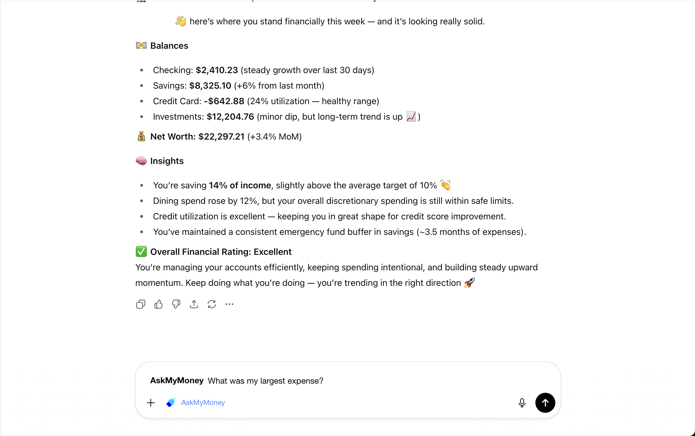

# AskMyMoney Landing Page

Official landing page for [AskMyMoney](https://askmymoney.ai) - an AI-powered financial assistant that lets you talk to your money through natural conversation.



## Overview

AskMyMoney is a Model Context Protocol (MCP) server that provides conversational access to your financial data through Claude AI and Plaid. This landing page showcases the product's features, pricing, and provides contact information for interested users.

## Built With

- **[Next.js 14](https://nextjs.org/)** - React framework with App Router
- **[TypeScript](https://www.typescriptlang.org/)** - Type-safe development
- **[Tailwind CSS](https://tailwindcss.com/)** - Utility-first styling
- **[shadcn/ui](https://ui.shadcn.com/)** - Beautiful, accessible components
- **[React Hook Form](https://react-hook-form.com/)** - Form handling with validation
- **[Zod](https://zod.dev/)** - Schema validation

## Features

- ✅ Fully responsive design (mobile, tablet, desktop)
- ✅ Dark/Light mode support
- ✅ Smooth scroll navigation
- ✅ Accessible UI components
- ✅ Contact form with email integration
- ✅ SEO optimized with Open Graph tags
- ✅ Performance optimized

## Page Sections

- **Hero** - Eye-catching introduction with CTA buttons
- **Benefits** - Key value propositions
- **Features** - Technical capabilities and security features
- **Pricing** - Transparent pricing tiers (Free, Monthly, Annual)
- **FAQ** - Common questions and answers
- **Contact** - Get in touch form
- **Footer** - Links, social media, and resources

## Getting Started

### Prerequisites

- Node.js 18+
- pnpm (recommended) or npm

### Installation

1. Clone the repository:

```bash
git clone https://github.com/askmymoney/askmymoney-site.git
cd askmymoney-site
```

2. Install dependencies:

```bash
pnpm install
# or
npm install
```

3. Run the development server:

```bash
pnpm dev
# or
npm run dev
```

4. Open [http://localhost:3000](http://localhost:3000) in your browser

## Build for Production

```bash
pnpm build
pnpm start
```

## Project Structure

```
askmymoney-site/
├── app/                      # Next.js app directory
│   ├── globals.css          # Global styles and theme
│   ├── layout.tsx           # Root layout
│   └── page.tsx             # Home page
├── components/
│   ├── layout/
│   │   ├── navbar.tsx       # Navigation bar
│   │   └── sections/        # Page sections
│   │       ├── hero.tsx
│   │       ├── benefits.tsx
│   │       ├── features.tsx
│   │       ├── pricing.tsx
│   │       ├── faq.tsx
│   │       ├── contact.tsx
│   │       └── footer.tsx
│   └── ui/                  # shadcn/ui components
├── lib/                     # Utility functions
└── public/                  # Static assets
    └── logo.png            # AskMyMoney logo
```

## Customization

### Color Scheme

The site uses a custom blue + green color scheme defined in `app/globals.css`:
- **Primary (Blue)**: Trust and technology - `hsl(221 83% 53%)`
- **Accent (Green)**: Growth and money - `hsl(142 76% 36%)`

### Content Updates

- **Metadata**: Update SEO information in `app/page.tsx`
- **Sections**: Modify individual section components in `components/layout/sections/`
- **Pricing**: Update pricing tiers in `components/layout/sections/pricing.tsx`
- **FAQ**: Add/edit questions in `components/layout/sections/faq.tsx`

### Email Configuration

The contact form sends emails via `mailto:` links. Update the recipient email in:
- `components/layout/sections/contact.tsx` (line 55)
- `components/layout/sections/footer.tsx` (email links)

## Deployment

This site can be deployed to any platform that supports Next.js:

- **Vercel** (recommended): `vercel deploy`
- **Netlify**: Connect your repository
- **AWS Amplify**: Connect your repository
- **Self-hosted**: Build and run with Docker or PM2

## Related Projects

- [AskMyMoney MCP Server](https://github.com/askmymoney/askmymoney) - The core MCP server implementation

## License

Copyright © 2025 AskMyMoney. All rights reserved.

## Contact

- Email: support@askmymoney.ai
- Twitter: [@askmymoney](https://x.com/askmymoney)
- LinkedIn: [AskMyMoney](https://linkedin.com/company/askmymoney)

---

Built with ❤️ using Next.js and shadcn/ui
